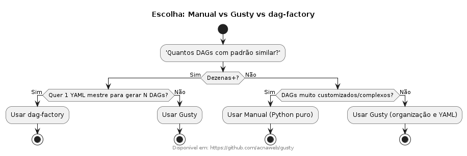

# Manual: **DAGFactory com Gusty no Airflow**

## 1. Título
Uso combinado de **DAGFactory** e **Gusty** para geração dinâmica de DAGs no Apache Airflow.  



---

## 2. Instruções
1. **Instalação dos pacotes**
   ```bash
   pip install apache-airflow
   pip install dag-factory
   pip install gusty
   ```
2. **Organização dos diretórios**
   - Crie uma pasta `dags/` com a seguinte estrutura:
     ```
     dags/
     ├── gusty_dags/
     │   ├── example_dag/
     │   │   ├── extract.yaml
     │   │   ├── transform.yaml
     │   │   └── load.yaml
     ├── dagfactory_config.yaml
     └── dagfactory_dags.py
     ```

3. **Configuração do DAGFactory**
   - Exemplo de arquivo `dagfactory_config.yaml`:
     ```yaml
     example_dag:
       default_args:
         owner: data-team
         start_date: 2023-01-01
         retries: 1
       schedule_interval: "@daily"
       tasks:
         extract_task:
           operator: airflow.operators.bash_operator.BashOperator
           bash_command: "echo 'Extraindo dados...'"
         transform_task:
           operator: airflow.operators.bash_operator.BashOperator
           bash_command: "echo 'Transformando dados...'"
           dependencies: [extract_task]
         load_task:
           operator: airflow.operators.bash_operator.BashOperator
           bash_command: "echo 'Carregando dados...'"
           dependencies: [transform_task]
     ```

   - Loader em `dagfactory_dags.py`:
     ```python
     import dagfactory

     dag_factory = dagfactory.DagFactory("/usr/local/airflow/dags/dagfactory_config.yaml")
     dag_factory.generate_dags(globals())
     ```

4. **Configuração do Gusty**
   - Dentro de `gusty_dags/example_dag/`, cada `.yaml` representa uma task.
   - Exemplo `extract.yaml`:
     ```yaml
     operator: airflow.operators.bash_operator.BashOperator
     bash_command: "echo 'Extraindo dados com Gusty...'"
     ```

   - Carregando com Gusty (`dags/gusty_loader.py`):
     ```python
     import gusty

     dags = gusty.create_dags("dags/gusty_dags/")
     globals().update(dags)
     ```

5. **Execução**
   - Reinicie o Airflow (`airflow webserver` e `airflow scheduler`).
   - As DAGs aparecerão na interface do Airflow, tanto as criadas via **DAGFactory** quanto via **Gusty**.

---

## 3. Explicações
- **DAGFactory**  
  É um framework que gera DAGs dinamicamente a partir de um **arquivo de configuração YAML**. Facilita a padronização de DAGs e permite que equipes foquem na configuração sem precisar escrever código repetitivo em Python.  

- **Gusty**  
  É um framework que permite criar DAGs organizando arquivos YAML em **pastas estruturadas**. Cada diretório é uma DAG, e cada arquivo YAML dentro dele é uma task. Assim, é simples aplicar padrões como *extract → transform → load* em múltiplos pipelines.  

- **Integração**  
  - O **DAGFactory** é ótimo para **configuração centralizada** em um único arquivo YAML.  
  - O **Gusty** é ótimo para **organização modular** de DAGs em pastas.  
  - Muitas equipes utilizam **ambos**: Gusty para modularizar etapas e DAGFactory para padronizar configurações globais.  


  ## References

  - https://github.com/pipeline-tools/gusty